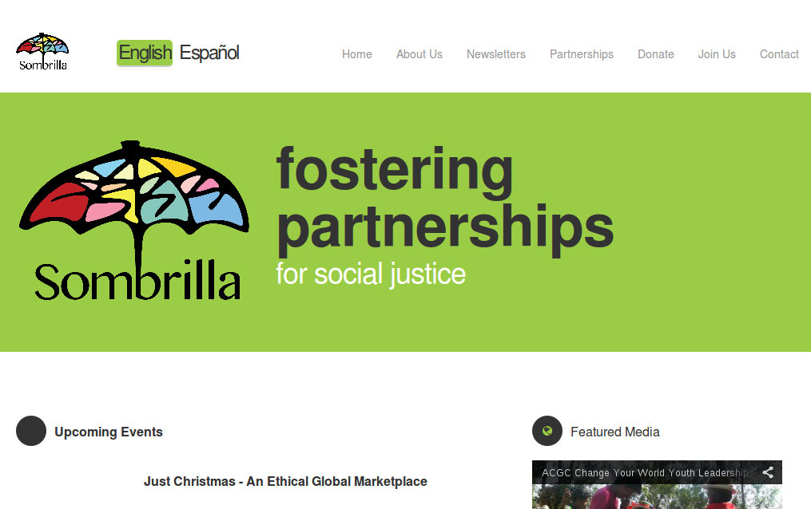

My name is **Ross Anderson**. I'm a Canadian software developer studying Computer Engineering at the [University of Alberta](http://ualberta.ca) in [Edmonton](http://edmonton.com/).

### Current Project

I am currently working with [Andrew Hoskins](http://github.com/ahoskins) on **Winston**: an elegant, intelligent alternative to [Schedule Builder](http://beartracks.ualberta.ca) for students at the [University of Alberta](http://ualberta.ca).

### Recent

**Microsoft Enterprise & Security - Quality**  
Collection, analysis and presentation of useful, actionable data. Intern project was related to [Bitlocker](http://windows.microsoft.com/en-ca/windows7/products/features/bitlocker).

**Sombrilla**  
Bilingual website redesign for a local organization. It can be found at [sombrilla.ca](http://sombrilla.ca).

**DiscoverE**  
Delivering science and programming summer camps for grades 1-9 at [DiscoverE](http://discovere.ualberta.ca) in Edmonton.
